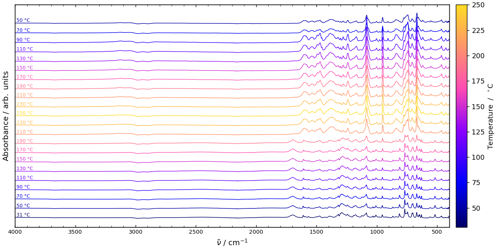
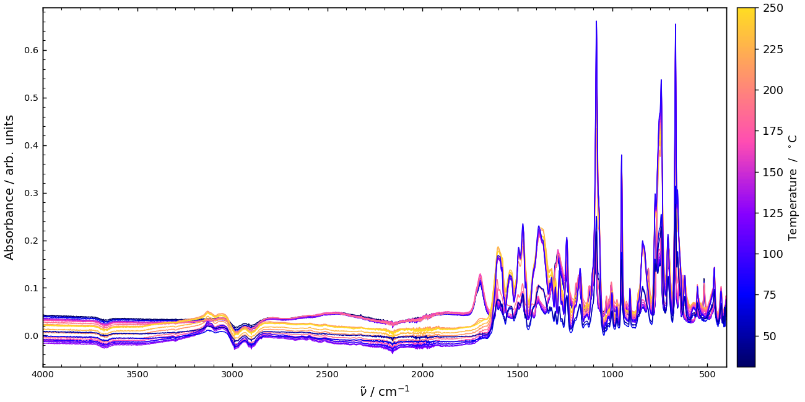
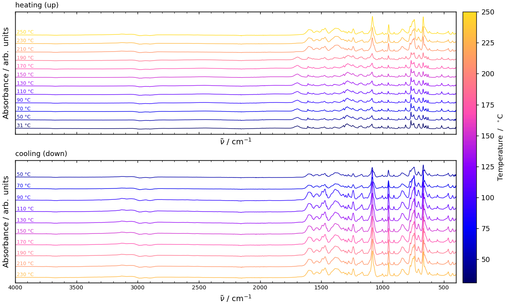

# VT-IR Plotter

Turn a folder of variable-temperature IR spectra into a publication-ready
figure with **one command** — reads Thermo OMNIC `.SPA` files **natively** (no
CSV export needed), groups spectra by heating/cooling direction, and figures out
Absorbance-vs-Transmittance on its own.



Point it at a folder of variable-temperature spectra and it does the rest —
temperature and scan direction are read straight from the filenames.

## Three display modes

| `--mode` | what you get |
| --- | --- |
| `overlay` | every spectrum on a shared baseline — true intensities, no offset |
| `stack` | a fixed vertical offset between spectra — the classic waterfall *(default)* |
| `updown` | two panels, **heating (up)** and **cooling (down)**, sharing one temperature colour scale — built to reveal hysteresis |

<p align="center">
  
  
</p>

Spectra are coloured by temperature (a shared colour bar), so the same
temperature is the same colour across both `updown` panels.

## Quick start

```
pip install numpy matplotlib
python plot_vt_ir.py examples
```

That renders the bundled example run (a real heating + cooling cycle, sample
name anonymised) as a waterfall. A few more:

```
python plot_vt_ir.py examples --mode updown          # heating vs cooling
python plot_vt_ir.py examples --mode overlay --unit T # overlaid, as %transmittance
python plot_vt_ir.py examples/omnic-spa --select bg   # read .SPA files directly
python plot_vt_ir.py examples --list                  # just report what it found
python plot_vt_ir.py examples --silent --ext png      # save examples.png, no window
```

Run with no folder argument to plot the current directory.

## What you'll see

Before plotting, it prints how it classified and unit-tagged every file:

```
file                                     kind    dir         T/C  unit (source)
------------------------------------------------------------------------------
00_DEMO_31C_up.csv                       sample  up           31  A (heuristic)
01_DEMO_50C_up.csv                       sample  up           50  A (heuristic)
...
11_DEMO_250C_up.csv                      sample  up          250  A (heuristic)
12_DEMO_230C_down.csv                    sample  down        230  A (heuristic)
...
21_DEMO_50C_down.csv                     sample  down         50  A (heuristic)
```

The `unit (source)` column tells you *how* each unit was decided — handy for a
quick sanity check before trusting the y-axis.

## How the unit (Absorbance vs Transmittance) is decided

A bare `.csv` does not record whether it holds absorbance or transmittance, so
the plotter resolves it **hierarchically** — first source that knows, wins:

1. **`--input-units` override** — you said so. One token for all files, or one
   per file (in `--list` order): `--input-units A` or `--input-units "A,T,A,…"`.
2. **`.SPA` header** — OMNIC stores the y data-type natively
   (`17` = absorbance, `16` = %transmittance, `15` = single beam, …). Authoritative.
3. **`.jdx` `YUNITS` field** — used when present.
4. **Background files** — single-beam by definition (naming convention).
5. **CSV heuristic** — scale-free look at the value distribution: baseline at the
   **bottom** of the range with peaks pointing up → Absorbance; baseline at the
   **top** with dips pointing down → Transmittance.

The *display* unit is independent: `--unit A` (default) or `--unit T`, with
absorbance ↔ transmittance converted as needed.

## Command reference

| flag | default | meaning |
| --- | --- | --- |
| `directory` | `.` | folder of spectra to plot |
| `--mode {overlay,stack,updown}` | `stack` | display mode (see above) |
| `--unit {A,T}` | `A` | display as Absorbance or %Transmittance |
| `--input-units` | auto | override the input unit (one token, or one per file) |
| `--select {sample,bg,all}` | `sample` | which spectra to plot |
| `--direction {both,up,down}` | `both` | scan-direction filter (overlay/stack) |
| `--offset` | auto | fixed vertical offset for stack/updown |
| `--norm {none,individual,global}` | `none` | normalise intensities |
| `--cmap` | `gnuplot2` | matplotlib colormap (mapped to temperature) |
| `--xlim HIGH LOW` | from data | wavenumber limits, e.g. `4000 400` |
| `--tick-step` | `500` | major x-tick spacing in cm⁻¹ (`0` = auto) |
| `--smiles` | – | draw a 2-D structure on the plot (needs RDKit) |
| `--title` | – | figure title |
| `--save` / `--ext` / `--dpi` | – / `svg` / `300` | output path / extension / raster DPI |
| `--silent` | off | save without opening a window |
| `--transparent` | off | transparent figure background |
| `--list` | – | print the classification report and exit |

## Input formats

Auto-detected per file by extension:

- **`.csv`** — semicolon-delimited, European-decimal (a typical OMNIC `.csv`
  export); also tolerates comma/whitespace delimiters and dot decimals.
- **`.spa`** — Thermo OMNIC binary, read directly. No need to batch-export to
  CSV first.
- **`.jdx` / `.dx`** — JCAMP-DX (`(X++(Y..Y))` tables).

## File-naming convention

Files are recognised by a chronological naming convention:

```
[NN_]BG_<sample>_<T>C.<ext>                    background  (single beam)
[NN_]<sample>_<T>C[_up|_down|_return].<ext>    sample spectrum
```

The leading `NN_` chronological index is optional. The `_up` / `_down` /
`_return` suffix sets the scan direction (a sample with no suffix is treated as
`up`); the temperature is read from `<T>C`.

## Installation

```
pip install numpy matplotlib
```

Python 3.9+. `numpy` and `matplotlib` are the only requirements. The optional
`--smiles` structure overlay additionally needs `rdkit` and `pillow`.

## Project layout

```
ACH-VT-IR-Plotter/
├─ plot_vt_ir.py        the plotter (single file, CLI)
├─ requirements.txt     numpy, matplotlib
├─ examples/            a real heating+cooling run (sample anonymised → "DEMO")
│  ├─ NN_DEMO_<T>C_up.csv / _down.csv
│  └─ omnic-spa/        a few single-beam .SPA backgrounds (native-read demo)
├─ docs/                README screenshots
└─ LICENSE              MIT
```

## How it works

<details>
<summary>Click to expand</summary>

**Reading `.SPA` natively.** OMNIC `.SPA` files carry a small section table at
byte offset 304 (16-byte entries: a `uint16` key, a `uint32` offset, a `uint32`
size). The reader walks it for two blocks: key `2` (the spectral header — point
count, first/last wavenumber, and the y data-type code at byte +12) and key `3`
(the `float32` intensity array). The wavenumber axis is reconstructed as a linear
ramp from first to last. The y data-type code is mapped to a unit the same way
[spectrochempy](https://www.spectrochempy.fr/) does it (17 = absorbance,
16 = %transmittance, 15 = single beam, 20 = Kubelka–Munk, …).

**The CSV unit heuristic** is deliberately scale-free, so it works whether
transmittance is stored as a fraction (~1.0 baseline) or a percentage (~100
baseline). It locates the baseline within the robust 1st–99th percentile range:
if the median sits near the bottom (peaks deviate **up**) the data is absorbance;
near the top (peaks deviate **down**) it is transmittance.

**Colour = temperature.** Every spectrum is coloured by its temperature through a
truncated colormap with a single shared `Normalize`, so colours are directly
comparable between the heating and cooling panels of `updown` mode. Curves in
`stack` / `updown` are ordered by acquisition (the `NN_` index) when present, so
the waterfall reads as the experiment progressed.

**Offsets.** `stack` and `updown` apply a fixed offset between consecutive
traces. The automatic value is just under one typical spectrum's amplitude (90 %
of the median 1–99 percentile span), so neighbours separate with a little
overlap; override it with `--offset`.

</details>

## Authorship and history

This project began as **[@p3rAsperaAdAstra](https://github.com/p3rAsperaAdAstra)**'s
personal IR plotting script, `plot_IR.py`. That original script and its data are
entirely the author's own work.

In June 2026 it was **refactored and substantially rewritten by Claude
(Anthropic's AI assistant)** at the author's direction, into the directory-driven
tool here. The user-visible changes:

- a directory-driven CLI with three display modes (`overlay`, `stack`, `updown`),
  the `updown` heating/cooling split being new;
- **native `.SPA` reading** (the original only read CSV/JCAMP), removing the
  per-file OMNIC export step;
- the **hierarchical Absorbance/Transmittance resolution** (SPA header → JCAMP
  units → background convention → CSV heuristic → manual override);
- recognition of the file-naming convention (temperature, scan direction,
  background vs sample);
- temperature colour bar, per-curve labels, and assorted bug fixes in the
  normalisation helpers.

The plotting *style* (inverted wavenumber axis, mirrored top ticks, truncated
`gnuplot2` temperature colouring, the optional SMILES structure overlay) is
carried over from the original. This note is here for transparency about what is
and isn't human-authored.

The bundled example spectra are a real VT-IR run; the sample identifier has been
anonymised to `DEMO`.
